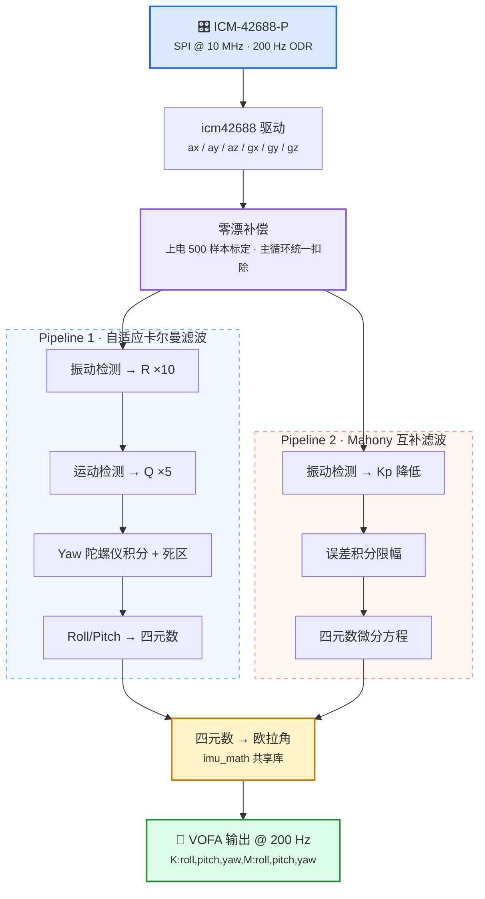
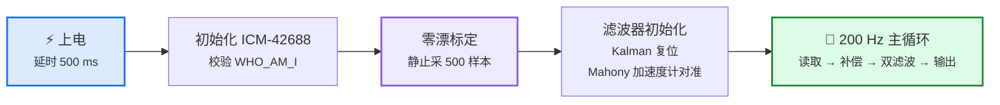

# kaerman — ESP32 IMU 姿态解算系统


> 基于 **ESP32-S3 + ICM-42688-P** 六轴传感器的双滤波器姿态解算系统。
> 自适应卡尔曼滤波与 Mahony 互补滤波并行运行，输出四元数与欧拉角，通过 VOFA+ 上位机实时可视化。

---

## 目录

- [功能特性](#功能特性)
- [系统架构](#系统架构)
- [硬件连接](#硬件连接)
- [传感器配置](#传感器配置)
- [滤波器参数](#滤波器参数)
- [启动流程](#启动流程)
- [串口输出格式](#串口输出格式)
- [构建与烧录](#构建与烧录)
- [项目结构](#项目结构)
- [参考链接](#参考链接)

---

## 功能特性

| 特性 | 说明 |
|------|------|
| 双滤波器并行 | 自适应卡尔曼 + Mahony 互补滤波，同帧对比输出 |
| 四元数姿态解算 | 四元数 → ZYX 欧拉角（Roll / Pitch / Yaw） |
| 振动自适应 | 加速度计幅值偏离 1g 时，卡尔曼增大 R、Mahony 降低 Kp |
| 运动自适应 | 角速度超过阈值时，卡尔曼增大 Q 加快跟踪 |
| Yaw 死区 | 0.5 dps 以下不积分，抑制静态漂移 |
| 陀螺仪零漂标定 | 上电静止采样 500 次取平均，主循环统一补偿 |
| Mahony 快速初始化 | 首帧用加速度计直接解算初始四元数，无需收敛等待 |
| 自研数学库 | 快速平方根倒数 + 安全三角函数，无 `math.h` 依赖 |

---

## 系统架构



---

## 硬件连接

目标芯片：**ESP32-S3**

| 功能 | ESP32-S3 GPIO |
|:----:|:----:|
| SPI_SCLK | 12 |
| SPI_MOSI | 11 |
| SPI_MISO | 10 |
| SPI_CS | 9 |

---

## 传感器配置

| 参数 | 配置值 |
|------|--------|
| 陀螺仪量程 (FSR) | ±1000 dps |
| 加速度计量程 (FSR) | ±2 g |
| 输出数据率 (ODR) | 200 Hz（陀螺仪 / 加速度计） |
| SPI 时钟 | 10 MHz (SPI2_HOST) |
| 主循环采样率 | 200 Hz |

---

## 滤波器参数

### Pipeline 1 — 自适应卡尔曼

| 参数 | 值 | 说明 |
|------|-----|------|
| Q_angle | 0.001 | 角度过程噪声 |
| Q_bias | 0.003 | 零偏过程噪声 |
| R_measure | 0.03 | 测量噪声基准 |
| 振动阈值 | 0.08 g | 幅值偏离 1g 超过该值判定为振动 |
| 振动 R 放大 | ×10 | 振动时降低加速度计权重 |
| 运动阈值 | 20 dps | 角速度超过该值判定为快速运动 |
| 运动 Q 放大 | ×5 | 运动时加快滤波器跟踪 |
| Yaw 死区 | 0.5 dps | 死区内不积分，抑制漂移 |

### Pipeline 2 — Mahony 互补滤波

| 参数 | 值 | 说明 |
|------|-----|------|
| Kp | 8.0 | 比例增益（加速度计校正速率） |
| Ki | 0.002 | 积分增益（陀螺仪零偏收敛） |
| 积分限幅 | 0.3 | 防止积分饱和 |
| 振动阈值 | 0.08 g | 与卡尔曼一致 |
| 振动 Kp 下限 | ×0.1 | 强振动时 Kp 最低降至 10% |
| Yaw 死区 | 0.5 dps | 与卡尔曼一致 |

---

## 启动流程



---

## 串口输出格式

采用 VOFA+ FireWater 协议：

```
K:roll,pitch,yaw,M:roll,pitch,yaw
```

| 前缀 | 含义 |
|:----:|------|
| `K:` | 卡尔曼滤波欧拉角输出（度） |
| `M:` | Mahony 滤波欧拉角输出（度） |

---

## 构建与烧录

需要 [ESP-IDF v5.4.3](https://docs.espressif.com/projects/esp-idf/en/stable/esp32s3/get-started/index.html) 环境。

```bash
idf.py set-target esp32s3      # 首次设置目标芯片
idf.py build                   # 编译
idf.py -p COM18 flash monitor  # 烧录 + 串口监控（端口按实际修改）
```

---

## 项目结构

```
main/
├── hello_world_main.c   # 应用入口：标定 + 双滤波器主循环
├── hw_spi.c / .h        # ESP32 硬件 SPI 驱动 (SPI2_HOST)
├── icm42688.c / .h      # ICM-42688-P 传感器驱动
├── imu_math.c / .h      # 数学库：快速平方根倒数、安全三角函数、四元数工具
├── kalman.c / .h        # 自适应卡尔曼滤波器（Pipeline 1）
└── ahrs.c / .h          # Mahony 互补滤波器（Pipeline 2）
```

### 关键数据结构

| 结构体 | 内容 |
|--------|------|
| `icm42688_sensor_data_t` | 加速度 (g)、角速度 (dps)、温度 (°C) |
| `kalman_output_t` | 四元数 + 欧拉角 + 振动/运动权重 + 自适应 R/Q |
| `mahony_output_t` | 四元数 + 欧拉角 + 振动权重 + Yaw 角速度 |
| `imu_quat_t` | q0(w), q1(x), q2(y), q3(z) |
| `imu_euler_t` | roll, pitch, yaw（度） |

---

## 参考链接

- [ICM-42688-P Datasheet](https://invensense.tdk.com/wp-content/uploads/2020/11/ds-000347-icm-42688-p-datasheet.pdf)
- [VOFA+ 上位机](https://vofa.plus/)
- [ESP-IDF 编程指南](https://docs.espressif.com/projects/esp-idf/zh_CN/stable/esp32s3/)
